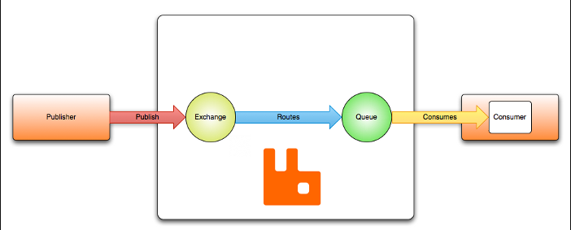

# RabbitMQ

**RabbitMQ** é um software open source de mensageria (também conhecido como messaging broker ou queue manager). 
Ele permite a troca de mensagens, habilitando a comunicação assíncrona entre diferentes processos, aplicações ou servidores. 
Foi desenvolvido originalmente pela Rabbit Tecnologies Ltda e posteriormente adquirido pela VMware. 

Antes de entrar em mais detalhes sobre o Rabbit, é importante estar em dia com alguns conceitos utilizados por ele.

Nesse tipo de comunicação, temos dois agentes que interagem com o broker. 
São eles o produtor, aquele responsável por enviar as mensagens, e o consumidor, que fará a leitura dessas mensagens. 
O Rabbit faz o meio de campo entre os dois, permitindo que ambos se comuniquem mesmo que não estejam em um mesmo servidor. 
Em alguns casos, a mesma aplicação pode atuar como produtora e consumidora.

Como citado, produtor e consumidor se comunicam através de mensagens. Quando falamos sobre **"mensagem"**, nos referimos a informações e/ou dados que são enviados de uma aplicação para outra. 
As mensagens armazenadas e transferidas pelo Rabbit podem ser de praticamente qualquer tipo, desde uma simples mensagem de texto, até comandos mais complexos. 
Inicialmente, as mensagens serão armazenadas pelo Rabbit até que um consumidor faça a leitura delas e após isso serão descartadas. 
Esse comportamento pode ser alterado através de configurações nos seus componentes.

Em sistemas de mensageria como o Rabbit, temos duas formas de comunicação:  

**_Point to Point (message queuing):_** nessa comunicação temos um produtor (também chamado de sender) e um consumidor (também conhecido como receiver). 
O que caracteriza uma comunicação _point-to-point_ é que a mensagem pode ser lida apenas uma vez.

**_Publish/Subscribe (Pub-Sub):_** mais uma vez temos o envio de dados do produtor para o consumidor, mas a grande diferença é que nesse caso a mensagem pode ser entregue para um ou mais consumidores.

Falando sobre casos de uso, o Rabbit normalmente é usado quando queremos executar algo background, sem forçar a espera da finalização desse processo. 
Isso é importante principalmente quando o processamento é pesado, como geração de arquivos, ou depende da atuação de terceiros, como a confirmação de pagamentos e dados de um cartão.
Ele também é muito utilizado ao trabalhar com sistemas distribuídos, permitindo a comunicação entre eles de uma maneira fácil e simples.

## How to Run

Uma das principais características do Rabbit é ser leve e fácil de implantar, seja em estrutura on premise ou na nuvem. Ele pode ser instalado e utilizado de diversas formas e em diferentes ambientes:

**_On Premise_**

Podemos instalar ele diretamente no servidor, sendo que são oferecidas versões para as principais distribuições para Linux, como Ubuntu e Debian, e Windows.

**_Docker_**
		
Também podemos facilmente rodar ele em Docker. No Docker Hub existem imagens oficiais que permitem facilmente disponibilizar um Rabbit ou mesmo um Cluster em qualquer gerenciador de container como Kubernetes e Mesos.
Para executar em docker, podemos utilizar o comando abaixo: 

> docker run -d --name local-rabbit -p 15672:15672 -p 5672:5672 rabbitmq:3.8-management

Nesse comando são expostas duas portas do container: 15672 e 5672. Isso porque a porta 5672 é a default utilizada para a comunicação com a API do Rabbit, enquanto a porta 15672 é para acesso ao management da aplicação.

**_Cloud Solutions_**

Existem ainda soluções em nuvem, como o [CloudAMQP](https://www.cloudamqp.com/), que provê toda a estrutura pronta para uso, sendo necessário apenas criar uma conta e escolher um plano, inclusive com planos 100% free disponíveis.

### Management

O Rabbit possui uma API, que fornece um jeito fácil e simples de criar itens e enviar comandos para a aplicação. 
Graças a essa API, existem SDK's para as principais linguagens de programação, que permitem toda a configuração e utilização do Rabbit via código.
Além da API, o Rabbit fornece uma interface gráfica para gerenciamento e manutenção de toda a estrutura.

## PROTOCOLO AMQP

**AMQP (Advanced Message Queuing Protocol)** é um protocolo que define como as aplicações clientes irão se comunicar com o messaging broker. 
Podemos dizer que o AMQP está para um sistema a mensageria como HTTP está para API's REST.
As definições e regras que consumidores e produtores devem seguir para conseguir se comunicar com um broker são definidas por esse protocolo, focando em orientação a mensagem, enfileiramento, roteamento, consumo, confiabilidade e segurança.
O objetivo principal é permitir a total interoperabilidade funcional entre clientes e brokers de mensagens. 

Por padrão Rabbit implementa a versão **0-9-1** desse protocolo, sendo que a última disponível é a **1.0**. Isso é importante porque existem muitas mudanças entre essas versões, o que as tornam praticamente incompatíveis.
Mesmo assim o Rabbit oferece suporte a versão _1.0_ do AMQP através de plugin. 

Além do protocolo AMQP, Rabbit tem plugins para dar suporte a outros dois protocolos: STOMP (Streaming Text Oriented Messaging Protocol) e MQTT (MQ Telemetry Transport). 

### Definição do modelo AMQP

No protocolo AMQP, é definido que mensagens são publicadas para exchanges, que podem ser comparadas a caixas de email. 
São elas que distribuem uma cópia da mensagem recebida para cada fila, usando regras chamadas de *binding*.
Uma vez que a mensagem chega a fila, o broker faz a entrega para os consumidores subscritos ou para aqueles que solicitem.

O AMQP é conhecido como um protocolo programável, porque as suas entidades, como filas, exchanges e os esquemas de rota, são definidas pelas aplicações que as utilizam.
A forma como realizar as operações são definidas pelo protocolo, mas as aplicações são responsáveis por criar tudo que precisam.

A seguir vamos dar uma olhada nos principais componentes do protocolo AMQ e que por tabela, são os mais utilizados no Rabbit.

## EXCHANGES

Exchanges são entidades para onde as mensagens são enviadas, ou seja, o ponto de entrada para elas. 
Quando falamos que uma aplicação "envia a mensagem para uma fila" na verdade ela envia para uma Exchange.
São elas as responsáveis por fazer a entrega dessa mensagem para uma ou mais filas. 
O fluxo padrão de uma mensagem dentro do Rabbit segue o passo a passo abaixo: 

1. Produtor publica a mensagem
2. A exchange recebe a mensagem e fica responsável pelo roteamento da mesma
3. A exchange faz o roteamento da mensagem para uma ou mais filas.
4. A mensagem fica na fila até ser lida ou enviada a um consumidor
5. O consumidor faz a leitura da mensagem.

O roteamento utilizado nessa lógica depende do tipo da exchange e das regras chamadas de **binding**. 

Além do tipo, existem opções que podemos definir ao criar uma exchange:  

**_Durability:_** podemos escolher entre duas opções de durabilidade: duráveis ou temporárias.
Exchanges duráveis são aquelas que existirão até que sejam explicitamente removidas, mesmo que a instância da aplicação reinicie. 
Temporárias são exchanges que existem enquanto a aplicação está rodando, e são apagadas uma vez que a aplicação morrre. 

**_Auto Delete:_** essa opção, quando marcada como _Yes_ indica que a exchange será automaticamente removida quando não tiver mais nenhuma fila ligada a ela.

**_Internal:_** exchanges com essa opção marcada como _Yes_ não recebem mensagens de clientes externos. Apenas outras exchanges podem enviar mensagens para essas filas.

**_Arguments:_** opcional, é usado por plugins e por features especificas.

Exchanges podem ter relação com filas e outras exchanges, sendo possível manter ligação com um ou mais itens. 
Elas não armazenam mensagens, ou seja, se uma exchange recebe uma mensagem e não possui nenhuma fila ou exchange ligada a ela, a mensagem será descartada ou então retornada ao produtor. 

Antes de ver os tipos de exchanges, vamos ver um pouco mais sobre binding.

### Bindigs 

Binding é a ligação entre uma fila e uma exchange, ou mesmo a duas exchanges.
Quando criamos essa ligação, podemos definir uma chave que será utilizada pela exchange para determinar se a mensagem recebida deve ou não ser encaminhada.

Essa chave recebe o nome de **Binding Key** e é através do dela que a exchange pode determinar como fazer o roteamento de uma mensagem.
Podemos pensar no binding key como um endereço da fila, informado a exchange no momento da ligação.

Alguns tipos de filas também trabalham com o atributo **_Routing Key_**, enviado junto da mensagem. 
Podemos pensar no routing key como o endereço de destino da mensagem, utilizado para fazer a entrega aos interessados. 
Ele não é obrigatório, e o produtor pode não informa-la ao fazer envio de uma mensagem. Nesses casos, o comportamento da exchange vai depender de seu tipo.

Então a combinação binding, binding key e routing key, junto ao tipo da exchange, diz como uma mensagem deve ser roteada.

### TIPOS DE EXCHANGES 

#### Direct

Uma **Direct Exchange** encaminha mensagens procurando por um binding key exatamente igual ao routing key fornecido pelo produtor. 
É extremamente util quando utilizamos uma mesma exchange para distribuir mensagens para múltiplas filas. 
Caso a _direct exchange_ não consiga encaminhar a mensagem para uma fila, ela será descartada. 

No Rabbit existe uma _direct exchange_ default chamada **"amqp.direct"**.

#### Topic

**Topic Exchange** encaminha mensagens para uma ou mais filas com base na comparação entre o routing key da messagem e o padrão definido no binding key.
Ele faz o roteamento baseado nesse padrão, porém a routing key não precisa ser exatamente igual ao binding key. 
Simplificando um pouco, é como se aplicássemos uma "expressão regular" sobre o routing key. 
Caso o routing key corresponda a essa _"expresão"_, a mensagem será encaminhada.

Nesse caso o routing key precisa ser uma lista de palavras separadas por ponto. 
Já no binding key, podemos utilizar dois simbolos para delimitar o tipo de comparação que queremos: 

* **_asterisco (\*):_** nesse caso buscamos um match de uma palavra em uma posição especifica. 
> Ex.: se o binding key for __binding.\*.test.\*__, o encaminhamento só será acionado para um routing key onde a primeira palavra é binding e a terceira palavra _test_

* **_sharp (#):_** indica que a correspondência do routing key pode ser com zero ou mais palavras. 
> Ex.: se o binding key for __example.other.#__, o encaminhamento ocorre para qualquer routing key que comece com _example.other._, independente das demais informações.

O Rabbit também tem uma fila default para esse tipo de exchange, chamada **"amqp.topic"**.

#### Fanout

**Fanout Exchange** é o tipo mais simples, pois, encaminha a mensagem recebida para todas as filas que estão conectadas a ela, desconsiderando qualquer routing key. 
Por esse motivo, mensagens sem routing key não são descartadas nesse tipo de exchange, como acontece com os dois anteriores.
É com esse tipo de exchange que conseguimos fazer uma comunicação publish e subscriber no Rabbit: cada novo consumidor cria a sua própria fila e faz o binding na _fanout exchange_, e a partir dai receberá todas as mensagens que chegam a exchange.

A fanout exchange default é a **"amqp.fanout"**.

#### Header

**Header Exchange** é desenhada para distribuir mensagens de acordo com atributos que são expressados mais facilmente no header da mensagem do que no routing key.
Nesse caso o routing key é ignorado completamente e apenas os atributos do header são considerados.

Podemos fazer o binding em uma _header exchange_ utilizando mais de um atributo para isso.
Nesse caso precisamos informar a exchange se ela deve considerar todos os atributos iguais com aqueles recebidos na mensagem, ou apenas alguns deles.
Isso é feito informando o argumento **x-match** no binding da exchange. 
Quando esse argumento é setado como _any_, se qualquer header da mensagem for igual a um atributo do binding, a mensagem será roteada para a fila.
Caso o valor de _x-match_ seja _all_, a mensagem só será roteada se possuir todos os argumentos do bind da .

Também existe uma exchange padrão desse tipo, chamada **"amqp.headers"**

#### Default Exchange

**Default Exchange** não é exatamente um tipo. Essa exchange é um do tipo direct, e criada por padrão, sendo representada por uma string vazia.
Todas as filas criadas são automaticamente ligadas a essa exchange, sendo que o binding key definido nessa ligação será igual ao nome da fila.
Por ser uma _direct exchange_, é possível enviar mensagens para qualquer fila através da _default exchange_, se o routing key também for igual ao nome da fila.

## QUEUES

**Queues** é uma estrutura de dados sequencial que funciona no esquema FIFO - First In, First Out: a primeira que entra é a primeira que sai.
São as responsáveis por armazenar as mensagens que são enviadas pelos produtores até que sejam lidas por algum consumidor.

Todas as filas possuem nomes, que podem ser definidos pela aplicação ou manualmente, ou mesmo gerados aleatoriamente pelo broker.
Filas com o nome iniciado em _"amqp"_ são reservadas para uso interno do broker. 

Uma mesma fila pode ter mais de um consumidor "pendurado" nela. 
Todos estarão habilitados a ler as mensagens que chegam, mas a mensagem pode ser lida por apenas um consumidor.

Assim como nas exchanges, temos propriedades para configurar o comportamento de uma fila, e abaixo listamos algumas dessas propriedades:  

**Durable:** assim como na exchange, informa se a fila é durável ou temporária. Filas duráveis não são perdidas mesmo após o restart da aplicação.
		
**Lazy Mode**: normalmente a fila mantém um cache das mensagens na memória RAM, para uma rápida entrega. 
Filas do tipo Lazy ao contrário mantém o máximo de mensagens possíveis no disco para reduzir o uso da RAM. 
Isso geralmente reduz o throughput, mas protege a desempenho do Rabbit que não é afetado por uma fila grande com consumo lento.
		
**Message TTL (_x-message-ttl)_:** O tempo que uma mensagem publicada na fila pode permanecer nela antes de ser descartada.

**Auto-delete:** caso afirmativo, a fila será excluída após todos os consumers ligados a ela serem desconectados.

**Auto-expire _(x-expires)_:** informa quanto tempo uma fila pode estar sem uso antes de ser excluída automaticamente. Se não tiver nenhum consumer ela será removida mesmo que tenha mensagens.

**Max length _(x-max-length)_:** define a quantidade de mensagens não consumidas que uma fila pode manter. 
Em função do parâmetro **queue overflow behaviour**, uma vez atingido o máximo o RabbitMQ pode tomar três ações: descartar mensagens mais antigas, rejeitar novas mensagens ou rejeitar novas mensagens redirecionado-as para a DLX.

**Dead letter exchange _(x-dead-letter-exchange)_:** nome opcional da exchange usada para envio de mensagens rejeitadas ou expiradas.
		
**Dead letter routing key _(x-dead-letter-routing-key)_:** altera o routing key usado para envio de mensagens rejeitadas ou expiradas. 
Se não for informado, o routing key original da mensagem será usado.

## VIRTUAL HOSTS

**Virtual Host** ou **vhost** é a forma utilizada pelo Rabbit para segregar recursos de uma instância.
Conexões, exchanges, queues, bindings, permissões de usuário e outras coisas, tudo pertence a um vhost. 

Eles fornecem um grupo de separação lógica de recursos. Por exemplo, permissões em recursos são feitas por vhost. 
Um usuário não tem permissões globais, apenas permissões por vhost.

Dessa forma, conseguimos fazer o isolamento entre aplicações, ou mesmo entre ambientes diferentes de uma mesma aplicação.

Sempre bom lembrar que o isolamento é lógico, e os recursos físicos da maquina são compartilhados. 
Por isso, a quantidade de vhosts e a quantidade de itens de cada vhost estará limitado a esses recursos. 
Inclusive é possível limitar a quantidade de filas que um vhost pode armazenar.

Por padrão, o Rabbit fornece um vhost default, que pode ser utilizado caso nenhum outro seja fornecido.

Para criar novos vhosts, podemos utilizar a aba admin do console de gerenciamento do Rabbit. 
Nessa mesma aba também podemos criar novos usuários e relaciona-los ao vhost.

## Message Acknowledgements

Um conceito importante definido pelo AMQP é chamado de **message acknowledgements**. 

Sistemas que usam um broker de mensagem normalmente são distribuídos. 
Uma vez que a entrega da mensagem ou mesmo o processamento da mesma não é garantido, o broker precisa de um mecanismo de confirmação por parte do consumidor.

Quando um consumidor recebe uma mensagem, deve notificar o consumo da mesma para o broker assim que possível. 
O broker só irá remover a mensagem quando receber a notificação positiva sobre a leitura dela, seja de maneira individual ou através de um grupo de mensagens.

Em teoria isso garante que a mensagem não será perdida por qualquer problema no consumer.

## Dead letter exchange e Dead letter queue

**Dead letter exchange**, ou DLX, é a exchange utilizada para encaminhar mensagens que são descartadas por uma fila. 
Quando criamos uma fila, utilizamos o parâmetro _Dead letter exchange_ para informar qual a DLX usaremos nesses casos.
A DLX pode ser de qualquer dos tipos de exchanges suportados pelo Rabbit, desde que as características de cada tipo sejam respeitadas.

Como mencionado anteriormente, exchanges não armazenam mensagens. Por isso, ao trabalhar com DLXs também devemos utilizar DLQs.
**Dead Letter Queue**, ou simplesmente DLQ, é uma fila usada como um cemitério de mensagens, que por algum motivo não foi processada. 
Por ser uma fila de armazenamento, as DLQs não possuem consumidores, ou essas mensagens seriam consumidas por eles.

As mensagens recebidas por uma DLX seguem o mesmo padrão de redirecionamento: dependendo do tipo da exchange, do binding exchange->fila e do routing key da mensagem.
Quando uma mensagem é descartada por uma fila e enviada para a DLX, o routing key utilizado nesse encaminhamento pode ser o original enviado pelo produtor ou alterado caso a fila tenha definido o parâmetro _Dead letter routing key_.  

Quando a mensagem é descartada, ela sofre algumas alterações no header, onde são incluídas informações sobre o descarte: motivo, quantas vezes foi descartada, o nome da fila que estava antes, entre outras.

Existem diversos motivos para que ocorra o descarte de uma mensagem.
Por exemplo, digamos que tenhamos um bug no consumidor da fila que causa uma exception inesperada. 
Numa fila comum, sem a configuração de DLQ, poderíamos ter uma perda de mensagem, o que pode causar diversos problemas. 
Mesmo com política de retry configurada, um limite de tentativas será definido, e caso o problema não tenha sido resolvido, perderíamos a mensagem da mesma forma. 

Com uma DLQ configurada, essa mensagem não seria descartada, mas sim enviada para essa fila, dando tempo para resolvermos o problema e então reprocessa-la, sem perda de informação.

Outro exemplo onde a DLQ é util é em cenários onde temos uma alta quantidade de mensagens sendo processadas por uma mesma fila, e por conta disso definimos um TTL para cada mensagem, evitando um gargalho.
Ao vencimento do TTL, a mensagem será descartada, e enviada para a DLQ, evitando perda de informação.

## Delay Queue

Falando sobre DLQ, citamos o caso das mensagens que vão para a DLQ por conta do vencimento de seu TTL, e também sobre política de retry. 
Mas se ao invés de descartar a mensagem fosse interessante tentar reenviar novamente após um tempo? 
Nesse caso a DLQ não seria o melhor destino para essa mensagem, pois uma vez na DLQ a mensagem não seria consumida novamente, a não ser por interversão manual.

Para esses casos utilizamos as **Delay Queue**. Essas filas são utilizadas para deixar uma mensagem "esperando" por um determinado tempo antes de ser enfileirada novamente na fila principal.
Para isso, configuramos nosso DLX da fila principal para encaminhar a mensagem para nossa _Delay Queue_ ao invés da DLQ, configurando um novo TTL para ela.
Já na _Delay Queue_, o DLX envia a mensagem de volta para a fila principal. 

Assim o fluxo ficaria da seguinte forma:

1. A mensagem é recebida na fila principal
2. A mensagem não é consumida e o TTL definido na mensagem termina
3. A fila é encaminhada para o DLX
4. O DLX faz o roteamento da mensagem para a Delay Queue, definindo um novo TTL
5. A mensagem fica na Delay Queue até que o TTL vença novamente.
6. A fila então é encaminhada para um outro DLX
7. A mensagem é roteada para a DLQ, e fica armazenada nessa fila.

Em alguns cenários talvez faça sentido utilizar a _Delay Queue_ como "fila principal". 
Por exemplo, quando queremos agendar um processo para rodar após determinado tempo, podemos utilizar uma _Delay Queue_, que irá armazena a mensagem até que o TTL termine. 
Após isso a mensagem é encaminhada para a fila que irá dar inicio ao processo.

## Referencias 

* [Documentação Oficial](https://www.rabbitmq.com/documentation.html)

* [RabbitMQ Parte I - Iudarigun](https://medium.com/dev-cave/rabbit-mq-parte-i-c15e5f89d94)
* [RabbitMQ Parte II - Iudarigun](https://medium.com/dev-cave/rabbitmq-parte-ii-fa61a469ba2)
* [RabbitMQ Extras - Iudarigun](https://medium.com/dev-cave/rabbit-mq-extras-efa038e53db1)

* [RabbitMQ For Beginners: Part 1 - CloudAMQP](https://www.cloudamqp.com/blog/2015-05-18-part1-rabbitmq-for-beginners-what-is-rabbitmq.html)
* [RabbitMQ For Beginners: Part 4 - CloudAMQP](https://www.cloudamqp.com/blog/2015-09-03-part4-rabbitmq-for-beginners-exchanges-routing-keys-bindings.html)

* [Try RabbitMQ](http://tryrabbitmq.com/)